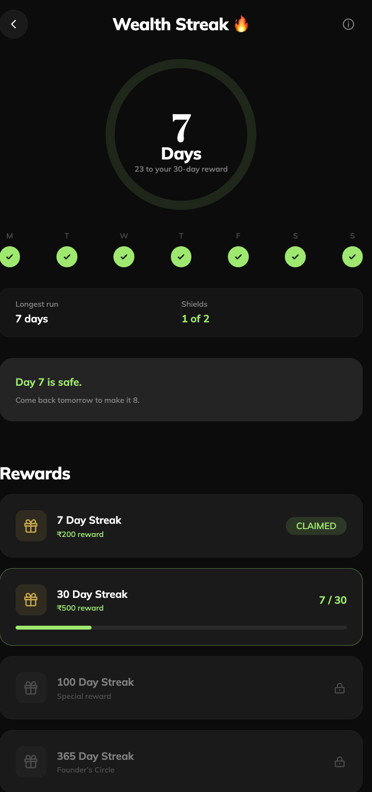
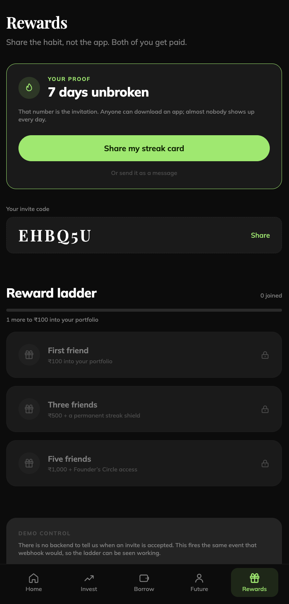
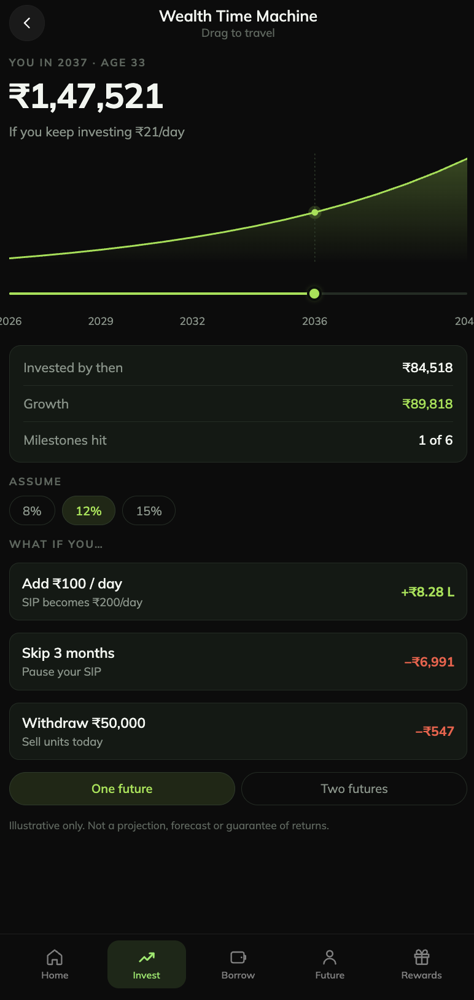
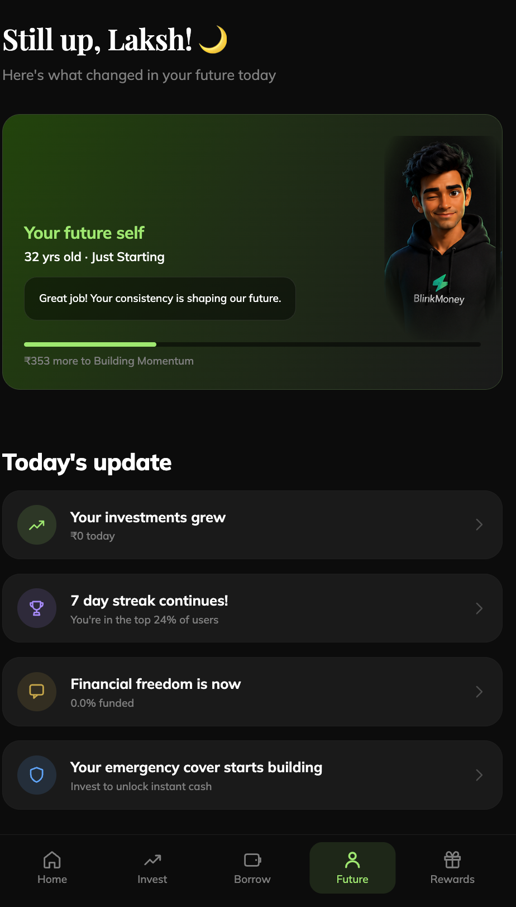

# BlinkMoney Future

**A behavioral wealth engine for daily investing consistency.**
React Native (Expo) · TypeScript · Expo Router · Reanimated 4 · React Compiler

---

## Screenshots

| Wealth Streak                                        | Rewards                                  | Share Milestone                                          |
| ---------------------------------------------------- | ---------------------------------------- | -------------------------------------------------------- |
|  |  |  |

| Wealth Time Machine                                       | Future Feed                                      |
| ----------------------------------------------------------- | -------------------------------------------------- |
|  |  |

---

## Table of contents

1. [What this is](#1-what-this-is)
2. [Run it](#2-run-it)
3. [The product thesis](#3-the-product-thesis)
4. [What shipped](#4-what-shipped)
5. [Feature deep dive](#5-feature-deep-dive)
   - [5.1 Boot gate and resumable sign-up](#51-boot-gate-and-resumable-sign-up)
   - [5.2 Story onboarding — Chapter 1: The Meeting](#52-story-onboarding--chapter-1-the-meeting)
   - [5.3 Future You — the avatar and its evolution](#53-future-you--the-avatar-and-its-evolution)
   - [5.4 Wealth Streak](#54-wealth-streak)
   - [5.5 Home / Today](#55-home--today)
   - [5.6 Future Feed](#56-future-feed)
   - [5.7 Borrow Without Break (Break Glass)](#57-borrow-without-break-break-glass)
   - [5.8 Invest](#58-invest)
   - [5.9 Wealth Time Machine](#59-wealth-time-machine)
   - [5.10 Rewards and referrals](#510-rewards-and-referrals)
   - [5.11 Share Milestone](#511-share-milestone)
   - [5.12 Profile menu and My Profile](#512-profile-menu-and-my-profile)
   - [5.13 FAQ](#513-faq)
   - [5.14 Navigation shell](#514-navigation-shell)
6. [Architecture](#6-architecture)
7. [The money engines](#7-the-money-engines)
8. [Persistence and migrations](#8-persistence-and-migrations)
9. [The mock API layer](#9-the-mock-api-layer)
10. [Design system](#10-design-system)
11. [Accessibility and motion](#11-accessibility-and-motion)
12. [Testing](#12-testing)
13. [Demo controls](#13-demo-controls)
14. [Project structure](#14-project-structure)
15. [What is real and what is mocked](#15-what-is-real-and-what-is-mocked)
16. [Edge cases](#16-edge-cases)

---

## 1. What this is

This is a response to the **BlinkMoney Frontend Engineering Assignment**: build a genuinely
new feature that could meaningfully improve engagement, retention and investing consistency —
not a re-skin of portfolio tracking.

The result is **FutureOS**: a connected behavioural layer on top of BlinkMoney's existing
model (_Invest → Grow → Borrow → Still Grow_) that gives compounding a face, a streak and a
reason to open the app tomorrow.

Everything in this repository is a working app. There is no backend, but there is a complete
typed API layer with latency, failures, timeouts, cancellation, retries, idempotency and an
offline queue — because loading, empty and error states are only honest if the code paths
that produce them actually exist.

---

## 2. Run it

```bash
npm install
npm start          # Expo dev server — scan the QR with Expo Go
npm run ios        # iOS simulator
npm run android    # Android emulator
npm run web        # web build

npm test           # domain + projection test suites (no framework, no build step)
npm run lint
npm run icons      # regenerate every launcher asset from the brand mark
```

`npm test` runs on Node's native TypeScript stripping (`--experimental-strip-types`), so the
whole domain layer stays testable without a bundler. Current state:

```
break-glass delta over 10y on ₹5,000: ₹20,228
✅ ALL TESTS PASS
2036 at 12% on ₹100/day: ₹15,21,150
✅ PROJECTION TESTS PASS
```

**Demo credentials.** Any valid Indian mobile number (10 digits, starting 6–9, not all the
same digit). The OTP is always `1111` and is printed on the screen — the mock has no SMS
channel, so hiding it would make the flow untestable.

---

## 3. The product thesis

Most investment apps are opened occasionally. Compounding is invisible day to day, so SIPs
get paused, consistency breaks, and the long-term goal stays abstract.

BlinkMoney helps users build wealth. FutureOS is designed to help users **fall in love with
building wealth** — because people protect _identity_ harder than they protect money.

The product is built around one question:

> **"Did I make tomorrow better today?"**

The behavioural loop:

```
Future Feed  →  one decision  →  Wealth Streak grows  →  Future You evolves
     ↑                                                            │
     └────────  Borrow Without Break protects progress  ←─────────┘
```

Five principles hold it together:

| Principle      | What it means in the build                                                                    |
| -------------- | --------------------------------------------------------------------------------------------- |
| **Identity**   | The avatar is the user's future self, not a mascot. It changes standing, not just expression. |
| **Progress**   | Every screen states a number that moved because of something the user did.                    |
| **Protection** | Shields cover a missed day; borrowing covers an emergency. Neither erases progress.           |
| **Emotion**    | Milestones get a modal celebration. A SIP commitment deliberately gets none.                  |
| **Simplicity** | One meaningful action per day, one button on the home screen.                                 |

---

## 4. What shipped

| #   | Feature                                      | Where                                                                                                                       | Status      |
| --- | -------------------------------------------- | --------------------------------------------------------------------------------------------------------------------------- | ----------- |
| 1   | Story-based onboarding                       | [meeting.tsx](<src/app/(story)/meeting.tsx>)                                                                                | **Shipped** |
| 2   | Future You avatar + evolution stages         | [future-avatar.tsx](src/components/future-self/future-avatar.tsx), [evolution.ts](src/domain/evolution.ts)                  | **Shipped** |
| 3   | Wealth Streak (shields, milestones, rewards) | [streak.tsx](src/app/streak.tsx), [streak.ts](src/domain/streak.ts)                                                         | **Shipped** |
| 4   | Borrow Without Break                         | [borrow.tsx](<src/app/(app)/borrow.tsx>)                                                                                    | **Shipped** |
| 5   | Future Feed                                  | [future.tsx](<src/app/(app)/future.tsx>), [feed.ts](src/domain/feed.ts)                                                     | **Shipped** |
| 6   | **Wealth Time Machine**                      | [time-machine.tsx](<src/app/(app)/invest/time-machine.tsx>), [projection.ts](src/lib/projection.ts)                         | **Shipped** |
| 7   | Referrals + reward ladder                    | [rewards.tsx](<src/app/(app)/rewards.tsx>), [referral.ts](src/domain/referral.ts)                                           | **Shipped** |
| 8   | Share Milestone (image export)               | [share-milestone.tsx](src/app/share-milestone.tsx), [share.ts](src/domain/share.ts)                                         | **Shipped** |
| 9   | Profile menu, My Profile, FAQ                | [profile-menu.tsx](src/components/profile/profile-menu.tsx), [profile.tsx](src/app/profile.tsx), [faq.tsx](src/app/faq.tsx) | **Shipped** |
| 10  | Home hero carousel + feature grid            | [hero-carousel.tsx](src/components/home/hero-carousel.tsx), [feature-grid.tsx](src/components/home/feature-grid.tsx)        | **Shipped** |

The original plan named "One Decision" as a deferred fifth feature. It shipped after all —
absorbed into the Time Machine's commit sheet, which is literally titled _One decision_.

---

## 5. Feature deep dive

### 5.1 Boot gate and resumable sign-up

**Files:** [index.tsx](src/app/index.tsx) · [\_layout.tsx](src/app/_layout.tsx) · [phone.tsx](<src/app/(onboarding)/phone.tsx>) · [otp.tsx](<src/app/(onboarding)/otp.tsx>) · [details.tsx](<src/app/(onboarding)/details.tsx>) · [validation.ts](src/domain/validation.ts)

The app's first screen is a **boot gate**, not a login screen. It shows the animated brand
mark (a spring-scaled bolt with a pulsing glow) while state is read from disk, then redirects
to whichever step the user last reached.

`onboardingStep` is persisted (`'phone' | 'otp' | 'details' | 'story' | 'done'`), so closing
the app halfway through sign-up resumes exactly where it stopped. Losing a verified phone
number because the app was backgrounded is the fastest way to lose a user before they see the
product.

**Step 1 — mobile number.** Input is capped at ten digits _at the source_, so an eleventh
digit cannot be typed, and formatted as `98765 43210` while typing. The full rule set still
runs on submit. Validation is deliberately specific rather than generic:

| Input             | Message                                         |
| ----------------- | ----------------------------------------------- |
| empty             | "Enter your mobile number"                      |
| < 10 digits       | "Enter all 10 digits"                           |
| doesn't start 6–9 | "Indian mobile numbers start with 6, 7, 8 or 9" |
| `9999999999`      | "That does not look like a real number"         |

Errors stay hidden until the field is _touched_ — and `autoFocus` firing a blur on an empty
field is explicitly guarded against, because scolding someone for a number they haven't typed
yet is hostile.

**Step 2 — OTP.** Four digits, auto-submits on the final keystroke (a `useRef` guard stops a
double fire if the user edits and re-completes quickly). A 30-second resend countdown. If the
screen is reached without a phone number in state — a deep link, or storage cleared mid-flow —
it redirects back to step one rather than rendering a broken form.

**Step 3 — details.** Name, age and gender on one screen, because all three are cheap to give
and belong together. Name validation uses `\p{L}\p{M}` — the combining-mark class is essential,
not decoration: Indic scripts build vowels from combining marks, so `अंकिता` is letters _and_
marks and `\p{L}` alone would reject most names written in Devanagari, Tamil or Bengali. Age is
gated at 18 (the real floor for investing) and capped at three digits so pasting a full date of
birth can't slip through.

Gender is a sliding segmented control rather than a pair of character cards, because it decides
which Future You the user meets on the next screen — and meeting that character works far
better as a reveal than as a thumbnail picked off a grid.

---

### 5.2 Story onboarding — Chapter 1: The Meeting

**Files:** [meeting.tsx](<src/app/(story)/meeting.tsx>) · [story.ts](src/domain/story.ts) · [dialogue.tsx](src/components/story/dialogue.tsx) · [story-stage.tsx](src/components/story/story-stage.tsx)

Instead of dropping the user into a dashboard, their future self introduces itself and asks
the one question the rest of the product hangs on.

Four typed dialogue beats, each with its own facial expression, so the character _acts_ the
line rather than just saying it:

| Beat | Line                                                           | Face        |
| ---- | -------------------------------------------------------------- | ----------- |
| 1    | "Hey, {name}."                                                 | `hello`     |
| 2    | "This might sound strange, but I'm you… a few years from now." | `confident` |
| 3    | "I've seen where your money can take us."                      | `happy`     |
| 4    | "Before we begin, I need to understand something."             | `thinking`  |

Then: **"Who are we building this future for?"** — five options (parents, future family, dream
home, financial freedom, not sure yet), each with a caption that turns the abstraction into a
concrete image ("The people who went without, so you didn't"). Choosing one flips the avatar to
a `laughing` expression, warms the stage lighting, and returns a tailored acknowledgement.

**Why it is built this way:**

- **Chapters are data, not screens.** `CHAPTER_ONE` is a plain object; one renderer walks its
  beats. Adding Chapter 2 costs a block of content, not another screen.
- **The whole upper half is one tap target.** "Tap to continue" works wherever the thumb lands.
  Tapping mid-type skips to the full line rather than doing nothing.
- **Back rewinds the story, not the navigator.** Back at the confirmation returns to the
  question; back at the question returns to the last line, already typed; back at line 1 hands
  control to the navigator. The Android hardware back button is wired to exactly the same
  function, so the two can never disagree about where "back" is.
- **The choice mutates real state.** `profile.purpose` is read later by the Future Feed's goal
  row (which picks a target: ₹10L for parents, ₹50L for a home, ₹1Cr for freedom), by the
  avatar's voice lines, and by My Profile. It is the emotional anchor, so it is persisted on the
  profile rather than held as transient story state.
- **Finishing tears the flow off the stack** (`router.dismissAll()`), so back from home leaves
  the app rather than replaying sign-up.

---

### 5.3 Future You — the avatar and its evolution

**Files:** [future-avatar.tsx](src/components/future-self/future-avatar.tsx) · [use-avatar-state.ts](src/components/future-self/use-avatar-state.ts) · [avatar-mask.tsx](src/components/future-self/avatar-mask.tsx) · [edge-fade.tsx](src/components/future-self/edge-fade.tsx) · [evolution.ts](src/domain/evolution.ts) · [registry.ts](src/theme/avatars/registry.ts)

**Twelve expressions per gender** — happy, laughing, wink, thinking, surprised, confident,
excited, cool, sad, serious, confused, hello — plus a full-body master used for the onboarding
reveal.

**One source of mood.** `useAvatarState()` reads the store and returns the same state to every
screen that shows the character. If Today said they were proud while the Future tab said they
were sad, the character would stop reading as a person and start reading as decoration. It
tracks four inputs: current streak, whether the streak is _broken_ (zero **and** a longest run
above zero — a brand-new user has not failed at anything), whether the user invested today, and
any milestone just reached.

**Evolution stages.** The character changes _standing_, not just expression, and every stage is
gated on **both** consistency and capital:

| Stage             | Badge      | Needs streak | Needs invested |
| ----------------- | ---------- | ------------ | -------------- |
| Just Starting     | Seedling   | 0            | ₹0             |
| Building Momentum | Builder    | 7 days       | ₹500           |
| Compounding       | Compounder | 30 days      | ₹5,000         |
| Financially Free  | Free       | 100 days     | ₹50,000        |
| Founder's Circle  | Founder    | 365 days     | ₹2,00,000      |

Both bars, never one: money without the habit is luck, the habit without money is a hobby.
`stageFor(0, 500000)` still returns `starting`, and so does `stageFor(400, 100)` — both are
asserted in the test suite.

`stageProgress()` returns the **lower** of the two axes, not the average, and
`bindingConstraint()` names which one is holding you back. A user with 200 days and ₹300 is not
halfway to the next stage — they are blocked on money, and showing the binding constraint is the
only version of this number that tells them what to do next.

**Art handling, honestly documented.** The vendor's "SVG" drop turned out to be PNGs wrapped in
an `<image>` tag, so the PNGs are the real assets. The two sets ship at different crops (male
248×433 half-body, female 220×246 head-and-shoulders), so `AVATAR_ASPECT` carries the true ratio
per gender instead of a single frame distorting one of them. Neither set has an alpha channel,
so each carries an opaque rectangle rendered on a slightly different near-black; `AVATAR_BACKDROP`
holds the sampled colour and the components paint it behind the image and feather the outer edge
into the page, hiding the seam without touching the artwork.

---

### 5.4 Wealth Streak

**Files:** [streak.tsx](src/app/streak.tsx) · [streak.ts](src/domain/streak.ts) · [streak-ring.tsx](src/components/streak/streak-ring.tsx) · [use-hold-charge.ts](src/components/streak/use-hold-charge.ts) · [hold-to-invest.tsx](src/components/streak/hold-to-invest.tsx) · [week-strip.tsx](src/components/streak/week-strip.tsx) · [reward-row.tsx](src/components/streak/reward-row.tsx) · [celebration.tsx](src/components/streak/celebration.tsx)

The retention engine. Two ideas do the work:

1. **A streak is alive if you contributed today _or_ yesterday.** It only dies once a full
   calendar day passes with nothing in it.
2. **Shields are earned consistency insurance.** One per unbroken week, capped at two, spent
   automatically to absorb a missed day. Missing one day after weeks of effort should sting, not
   erase the effort.

**Dates are local day indices, never timestamps.** A streak is a human, calendar-day concept:
"did I invest today?" must mean the same thing at 00:05 and 23:55, and must survive the user
flying between timezones. `dayIndex()` applies `getTimezoneOffset()` before flooring so the
boundary lands on _local_ midnight — using UTC would roll the streak over at 05:30 IST.

**The state machine** (all pure functions taking an explicit `today`, so every awkward case is
directly testable):

| Situation                                        | Result                                                    |
| ------------------------------------------------ | --------------------------------------------------------- |
| First contribution                               | `current = 1`                                             |
| Same day, second contribution                    | `duplicate: true` — money in, streak unchanged            |
| Contributed yesterday                            | Alive, nothing owed                                       |
| Missed 1 day, 1 shield held                      | Shield spent, streak continues intact                     |
| Missed 3 days, 2 shields held                    | Broken. `current = 0`, shields spent, `longest` preserved |
| Device clock jumps backwards                     | Treated as "no time passed" — never punished              |
| Streak rebuilt past a milestone it never crossed | The milestone is still _owed_, not skipped                |

**Milestones and rewards** at 7 / 30 / 100 / 365 days:

| Day | Reward           |
| --- | ---------------- |
| 7   | ₹200             |
| 30  | ₹500             |
| 100 | Special reward   |
| 365 | Founder's Circle |

The last two pay in status rather than cash on purpose: past a hundred days the streak is worth
more as identity than as ₹200. Reward status is derived from `milestonesReached` **history**,
never from `current` — a reward already earned must never re-lock after a break, and a milestone
that was skipped during a rebuild is still owed.

**Hold, don't tap.** The daily action is a press-and-hold that only commits at full charge
(1000ms), with a haptic tick every 150ms while charging. The charge lives in `useHoldCharge()`
rather than inside the button, so the **streak ring fills in the same motion as the button** —
the gesture physically enacts the thing it commits to. Release early and nothing is committed
(`cancelAnimation` means the completion callback fires with `completed: false`). The ring shows a
preview arc of where it lands after one more day, so you can see what you are filling toward.

After a commit the bar stays full through the write, then _eases_ to zero over 600ms rather than
snapping — on success the real progress rises to meet it as the charge falls away, so the arc
holds position. Snapping made the ring lurch backwards a frame, which read as losing the day it
had just earned.

**Milestone celebration** is mounted once at the **root**, above the navigator, so crossing 7,
30, 100 or 365 days celebrates wherever the contribution was made — Today, Invest or the streak
screen — rather than only on one of them. It is an 18-particle burst behind a zoom-in card with
the avatar at its most expressive (30 and 100 get a laugh, 365 gets pure swagger), modal by
design: it demands one tap to dismiss, which is what turns a number going up into a moment.

**Week strip** shows the current Monday-first week. `weekdayIndex()` derives the day of week
arithmetically (`((day % 7 + 7) % 7 + 3) % 7` — epoch day 0 was a Thursday) rather than
round-tripping through `Date`, which would reintroduce the exact timezone bug `dayIndex` exists
to avoid. The negative-index normalisation matters because JS `%` returns negatives, and time
travel or a hand-edited store can produce one.

---

### 5.5 Home / Today

**Files:** [home.tsx](<src/app/(app)/home.tsx>) · [hero-carousel.tsx](src/components/home/hero-carousel.tsx) · [feature-grid.tsx](src/components/home/feature-grid.tsx)

Answers one question the moment the app opens: _did I make tomorrow better today?_ The
portfolio number is the reward, the streak is the pressure, the single button is the whole loop.

**Hero carousel.** Five paged slides carrying BlinkMoney's own hero copy **verbatim from
blinkmoney.in**, not paraphrased — the value proposition is the one thing in this app that is
not ours to rewrite. "Better than your _Dad's FD_", "✦ Grow ✦ Borrow ✦ _Still Grow_", "Start
with just _₹21 a day_", "Cash without _selling_", "Your future has _a face_". It advances every
5 seconds, restarts its clock on any manual change, **pauses the instant a finger touches it**,
and opts out entirely under Reduced Motion. The active dot stretches into a pill rather than
just brightening, so position is legible at a glance.

**Portfolio hero.** Animated counter (`AnimatedNumber`) over the live simulated value, with
invested and growth split underneath.

**Streak card.** Tappable, routes to the full streak screen. The card turns `accent` when the
streak is at risk. The flame emoji is lit **only while the streak is alive** — burning over a
dead streak would make it decoration; withheld, it is worth earning back. A progress bar shows
distance to the next milestone.

**Daily action.** One button: _Invest ₹21 today_. Once done it is replaced by a calm "Today is
done" card. The hint line changes to a warning when the streak is at risk.

**Feature grid.** Six cards — Wealth Streak, Time Machine, Borrow don't break, Future You, Refer
& earn, Your why. Written as data, and a feature belongs here **only once it has a destination**,
which is what keeps it a navigation surface rather than a poster. Widths are computed from the
window rather than percentages, because a percentage plus a gap overflows on narrow screens and
silently collapses to one card per row.

---

### 5.6 Future Feed

**Files:** [future.tsx](<src/app/(app)/future.tsx>) · [feed.ts](src/domain/feed.ts) · [future-hero.tsx](src/components/future/future-hero.tsx) · [feed-row.tsx](src/components/future/feed-row.tsx)

The other tabs are about money. This one answers _"what changed in my future today?"_.

A time-of-day greeting, then the character reporting their own standing with a tappable set of
voice lines that cycle (always more than one — a card that says the same thing twice is not
worth tapping). Then four rows, in fixed order:

| Row        | What it says                                                         |
| ---------- | -------------------------------------------------------------------- |
| **Growth** | "Your investments grew — ₹X today"                                   |
| **Streak** | "47 day streak continues! — You're in the top 2% of users"           |
| **Goal**   | "Dream home is now — 3.2% funded" (target from the Chapter 1 answer) |
| **Safety** | "Emergency fund can now — protect you for 3.6 months"                |

Every line is computed in `@/domain/feed`, not assembled in JSX, so copy and arithmetic cannot
drift apart — which is exactly how a fintech ends up cheerfully reporting growth on an empty
portfolio. Each row has an expanded "why" and an action that jumps to the relevant tab, and only
one row opens at a time.

Three details worth calling out:

- **`growthToday()` excludes today's own contribution.** Today's deposit is capital moved, not
  money earned. It is measured per contribution across a one-day step rather than as
  `value(today) − value(yesterday)`, because `compound` floors negative day counts at the
  principal, so the naive subtraction silently cancels the deposit out to nothing.
- **Empty portfolios are not congratulated.** With nothing invested, the growth row reads "Your
  future is waiting to start" and the streak row reads "Your streak starts today".
- **The cohort percentile is documented mock data.** There is no backend to ask, and inventing a
  precise per-user figure would be worse than a stated band. The shape is drawn from published
  habit-app retention curves — the day-1-to-day-7 drop-off is brutal, and past 100 days almost
  nobody is left.

Below the feed, a projection table at 1 / 3 / 5 / 10 / 20 years, and a "Start over" reset.

---

### 5.7 Borrow Without Break (Break Glass)

**Files:** [borrow.tsx](<src/app/(app)/borrow.tsx>) · [simulation.ts](src/domain/simulation.ts) (`comparePaths`)

The product's whole thesis in one screen: **you can have the cash without selling the future.**

So the screen never just quotes an interest rate — it prices the alternative, in rupees, ten
years out. Selling ₹5,000 today does not cost ₹5,000; it costs everything that ₹5,000 would have
become. With the test-suite figures, that gap is **₹20,228 over ten years on a ₹5,000 need**.

The mechanics mirror BlinkMoney's published terms:

| Constant           | Value      | Source                |
| ------------------ | ---------- | --------------------- |
| `ANNUAL_RETURN`    | 15% p.a.   | "Save @ 15% p.a."     |
| `BORROW_RATE`      | 9.99% p.a. | "Borrow @ 9.99% p.a." |
| `MAX_LTV`          | 50%        | Loan-to-value ceiling |
| `MIN_DAILY_AMOUNT` | ₹21        | "Starts at ₹21/day"   |

The screen shows available headroom, an LTV bar drawn **against the 50% cap, not against 100%**
(a bar that fills at 50% LTV would read as "half used" when it is actually maxed out), four
amount chips as fractions of the limit so options scale with the portfolio, and the side-by-side
future comparison.

**What is deliberately absent from `postBorrow`:** the streak and the contribution ledger are
untouched. Borrowing costs interest, never progress. That is the entire feature, expressed as
code that doesn't exist.

With nothing invested, the screen shows an honest empty state rather than a live screen quoting
₹0 limits. Requests above the cap fail with a distinct, **non-retryable** `limit_exceeded` error,
so the UI never offers a "Try again" that cannot possibly succeed.

---

### 5.8 Invest

**Files:** [invest/index.tsx](<src/app/(app)/invest/index.tsx>) · [use-time-machine-portfolio.ts](src/hooks/use-time-machine-portfolio.ts)

The entry point to the Time Machine. Everything above the green card states where you are —
current value, all-time gain, daily SIP, invested, units, borrowable. The green gradient card is
the only thing on screen that talks about where you are _going_, and it exists to get tapped.

Its headline figure comes from the **same engine** the Time Machine uses, so the promise on this
card and the hero on the next screen can never disagree.

`useTimeMachinePortfolio()` reads the user's real holdings once they have any, and falls back to
a seeded fixture before that. A brand-new account has ₹0 and no history, which would make the
whole feature a flat line at zero — demonstrable to nobody. The fallback keeps it reviewable on a
fresh install **without ever overwriting a real number with a fake one**.

---

### 5.9 Wealth Time Machine

**Files:** [time-machine.tsx](<src/app/(app)/invest/time-machine.tsx>) · [projection.ts](src/lib/projection.ts) · [time-machine.ts](src/store/time-machine.ts) · [time-machine-api.ts](src/services/time-machine-api.ts) · [scrubber.tsx](src/components/time-machine/scrubber.tsx) · [projection-chart.tsx](src/components/time-machine/projection-chart.tsx) · [commit-sheet.tsx](src/components/time-machine/commit-sheet.tsx) · [states.tsx](src/components/time-machine/states.tsx) · [success.tsx](<src/app/(app)/invest/success.tsx>)

The largest feature in the build. **One screen, three modes** — scrubbing, applying a lever, and
comparing two futures are the same question at different magnifications, so switching between
them never navigates. The chart you were reading stays on screen and changes shape.

#### Mode A — scrub the years

Drag the scrubber and travel 2026 → 2041. The hero counter, the chart marker and the year label
are driven from **one shared value on the UI thread**, so all three move together with no React
render anywhere in the drag loop. The eyebrow reads _"You in 2036 · age 34"_.

The scrubber owns its shared value in the hook rather than the component, deliberately: a shared
value written inside the component it was passed _to_ is a prop mutation, which the React
Compiler rejects outright. The commit fires on `onFinalize`, not `onEnd` — a gesture cancelled by
a parent scroll never reaches `onEnd`, and the committed year would silently disagree with the
knob. The 3px track is the affordance; the touch target around it is a full 44pt.

#### Mode B — levers ("What if you…")

| Lever            | Effect               | Tone     |
| ---------------- | -------------------- | -------- |
| Add ₹100 / day   | SIP becomes ₹200/day | positive |
| Skip 3 months    | Pause your SIP       | negative |
| Withdraw ₹50,000 | Sell units today     | negative |

Each row shows its own live delta at the currently selected year. Applying one draws the levered
curve over a ghost of your current path and turns the hero into a green/red delta.

The rule the whole list rests on — **a lever that helps must raise the number and a lever that
hurts must lower it** — is asserted directly in the test suite. If it ever inverts, the app is
lying.

#### Mode C — two futures

Your consistent path against starting five years later, with the gap named in rupees and a card
explaining _why_ it is so wide: the first five years contribute the least money and the most
time, and time is the part you can't buy back later.

#### The engine

`computeSeries()` in [projection.ts](src/lib/projection.ts) is pure: no React, no clock, no
storage. **Every figure the Time Machine displays comes out of this one function**, so a number
can never appear on screen that the engine did not produce. Nothing on the screen is a literal —
the only way a screen full of future rupees stays honest when the rate is user-selectable.

- Compounds **monthly**, emits **yearly** points. Annual compounding would understate a daily SIP
  by treating eleven months of deposits as if they arrived on New Year's Eve.
- Growth is applied _before_ the deposit each month: a contribution made this month has not been
  invested long enough to have earned anything.
- `DAYS_PER_MONTH = 365.2425 / 12` — the Gregorian calendar's real 400-year mean.
- Every input is guarded. A corrupted store, a lever on an empty portfolio, or a withdrawal
  larger than the holdings all produce a sensible curve rather than `NaN`, which would render as
  a blank hero on a money screen.
- **Memoised, LRU-bounded at 64 entries.** Scrubbing changes only the _selected year_, not the
  curve, so the same series is requested every frame of a drag. Recomputing 180 months per frame
  is exactly what turns a 60fps gesture into a 40fps one.

Assumed rate is user-selectable (8% / 12% / 15%), persisted, and named in the disclaimer.
A milestone counter tracks six thresholds from ₹1L to ₹1Cr.

#### The commit — "One decision"

Applying the `sip+100` lever reveals **Make this real**, which opens a sheet showing today's SIP,
the new SIP, the extra per month, and the difference at the selected year.

- **Nothing is confirmed optimistically.** The success screen appears only after the mock
  resolves. A SIP change that appears to have worked and then quietly failed is the single worst
  outcome this flow can produce, because the user stops thinking about it.
- **Idempotency keys.** The key is minted before the request and reused on retry, so a lost
  response cannot turn one SIP change into two. The mock keeps an `accepted` map and returns the
  first result for a repeated key. This is why the client mints the key rather than the server:
  if the response is lost, the client cannot tell "never arrived" from "arrived and the reply
  vanished", and a SIP change is not something to guess about.
- **A failure leaves the sheet open** with the error visible — dismissing would hide the fact
  that nothing happened.

The success screen is **deliberately calm**. No confetti, no burst, no sound. This is a financial
commitment, not a level-up, and celebrating it the way a game would teaches the user that money
decisions are supposed to feel exciting. A tick, a before/after comparison and one haptic is the
whole reward — the second and last haptic in the entire feature.

#### Every non-happy state is real and reachable

The store is an explicit state machine, not a handful of booleans (`loading` and `error` being
independently true is not a state this feature has, and encoding that in the type is what stops
it happening):

```
idle → loading → ready | error | offline_queued
ready ↔ lever_preview → committing → success | error | offline_queued
```

| State       | What the user sees                                                                                                                                                                             |
| ----------- | ---------------------------------------------------------------------------------------------------------------------------------------------------------------------------------------------- |
| **Loading** | Skeleton blocks shaped like the arriving screen — hero, sub, chart, card. The layout does not shift when data lands.                                                                           |
| **Error**   | _"We couldn't load market data. Your money is safe and nothing was changed."_ The second half is the part that actually matters on a money screen.                                             |
| **Empty**   | _"There's no future to show yet. Start investing from ₹21 a day."_ Names the floor, so the user isn't left guessing whether they can afford to.                                                |
| **Offline** | Banner, dimmed hero, last-synced label — **and scrubbing still works**, because projections are computed on device.                                                                            |
| **Queued**  | _"Your SIP change to ₹200/day is saved. We'll submit it once you're back online — it won't be sent twice."_ The idempotency key is why that last clause can be promised rather than hoped for. |

**Hidden dev menu:** triple-tap the nav title to cycle normal → slow → offline → failing →
normal. Every state above is reachable on a real device without airplane mode, a proxy, or a
rebuild.

---

### 5.10 Rewards and referrals

**Files:** [rewards.tsx](<src/app/(app)/rewards.tsx>) · [referral.ts](src/domain/referral.ts)

The streak's loop, pointed outward: you share proof of a habit you are proud of.

Sharing leads with **"I've invested every day for 47 days straight"** rather than a code,
because the first is something a person says and the second is something an app says.

**The ladder** is deliberately shallow — three rungs, the first at a single friend. A programme
whose first reward needs five invites reads as something for other people.

| Friends | Reward                           |
| ------- | -------------------------------- |
| 1       | ₹100 into your portfolio         |
| 3       | ₹500 + a permanent streak shield |
| 5       | ₹1,000 + Founder's Circle access |

**Invite codes** are six characters, derived from the phone number rather than stored, so they
survive a wiped cache and can never disagree with themselves across devices. Details that matter:

- The number is **normalised to its last ten digits before hashing**, so `9876543210` and
  `+91 98765 43210` resolve to one code. A user whose code changed because the storage format
  shifted would be handing out an invite that silently belongs to nobody.
- **FNV-1a**, because it is short, dependency-free, and spreads adjacent numbers far apart —
  which matters because most of a user base shares a prefix. The test suite asserts ≥495 distinct
  codes across 500 consecutive numbers.
- The alphabet **excludes O, 0, I and 1**. Nobody should have to guess which one they heard when
  a code is read aloud.

Nothing on this screen invents social proof. The tier count is real persisted state, and the only
way it moves is an invite being accepted — exposed as an explicitly-labelled demo control that
fires the same event a backend webhook would, because a referral ladder with no way to advance it
is a screen nobody can review.

---

### 5.11 Share Milestone

**Files:** [share-milestone.tsx](src/app/share-milestone.tsx) · [milestone-card.tsx](src/components/share/milestone-card.tsx) · [share.ts](src/domain/share.ts)

The referral loop's payload. A code is something you have to persuade someone to type; a picture
of a 47-day streak persuades on its own, and the code rides along in the caption underneath.

**The card carries the whole message**, not a headline over a portrait — a screenshot forwarded
into a group chat arrives with no caption attached, so everything needed to understand the claim
has to survive on the image alone: the streak, the product name, the mechanism ("Liquid Wealth
Account"), and both rates (15% and 9.99%).

**A zero streak gets a different card**, not a "0 day streak". Nobody shares a scoreboard that
says nothing, and pretending otherwise makes the surface feel automated.

Four targets — Download, Instagram, WhatsApp, More — and **everything degrades**:

| Failure                                         | Fallback                                                |
| ----------------------------------------------- | ------------------------------------------------------- |
| `react-native-view-shot` absent from the client | Caught locally; shares caption as text                  |
| `expo-sharing` unavailable                      | Text share                                              |
| Photos permission denied                        | Plain message, no crash                                 |
| `expo-media-library` absent                     | System share sheet (which includes the gallery)         |
| WhatsApp not installed                          | Stated plainly, then the share sheet                    |
| Instagram story composer unavailable            | System sheet with the image                             |
| User dismisses the sheet                        | **Not** treated as an error — they simply did not share |

The capture module is imported **dynamically inside the handler**, not at module scope. It is a
native module, and a client that does not carry it throws on _import_ — which expo-router
surfaces as `Cannot read property 'ErrorBoundary' of undefined`, taking the whole navigator down
rather than just this button.

The card is captured from live views rather than assembled as a bitmap, so it exports at the
device's own pixel density. Filenames are stable per streak (`blinkmoney-streak-47.png`) so
re-saving doesn't litter the gallery.

---

### 5.12 Profile menu and My Profile

**Files:** [profile-menu.tsx](src/components/profile/profile-menu.tsx) · [profile.tsx](src/app/profile.tsx)

**The menu** is self-contained: it renders its own trigger (the avatar in the home header) and
owns its open state, so dropping it into any header is one line. It is presented through a
`Modal` rather than an absolute overlay, so the Android back button dismisses it and the screen
behind is genuinely inert — a menu you can scroll the page underneath is a menu that feels pasted
on.

The panel is a `BlurView` anchored to the top-right with `transformOrigin: 'top right'`, so it
reads as growing out of the button that opened it. A tint sits under the blur, because Android's
blur is weaker and that tint is what carries the panel there. It shows the avatar, first name, DNA
badge and current streak, then: My Profile · Refer a Friend · FAQ · Logout.

**Logout is named plainly.** This build has no server-side account, so signing out is a wipe —
saying "you can sign back in" would be a lie. The confirmation says exactly that: _"Your streak,
contributions and Future You live on this device. Logging out clears them and starts you at
sign-up again."_ The destructive row sits behind a hairline divider so it is never the row a thumb
lands on by momentum.

**My Profile** is a read-only account summary. Everything on it already exists somewhere in the
product — the point is that it exists in _one_ place, so a user can answer "what does this app
actually know about me?" without touring five tabs. Avatar, name, DNA badge, stage tagline,
progress to the next stage with the binding constraint named, then Account / Progress / Why you
started / Referrals sections.

---

### 5.13 FAQ

**Files:** [faq.tsx](src/app/faq.tsx) · [faq.ts](src/domain/faq.ts)

Five questions, as an accordion rather than five open blocks — the value of the screen is being
able to scan the questions and open only the one you came for, and one row open at a time keeps it
from becoming the wall of text it exists to avoid.

The content is **data, not JSX**, so copy can be reviewed, reordered or translated without
touching a screen, and answers stay in one place rather than being restated wherever a feature
happens to need explaining. The chevron rotation is driven from an effect rather than a
render-body assignment, because writing to a shared value during render mutates state React may
discard.

---

### 5.14 Navigation shell

**Files:** [(app)/\_layout.tsx](<src/app/(app)/_layout.tsx>) · [tab-bar.tsx](src/components/ui/tab-bar.tsx) · [back-button.tsx](src/components/ui/back-button.tsx)

Five tabs mirroring BlinkMoney's own loop: **Home · Invest · Borrow · Future · Rewards**.
Declared as explicit children rather than left to file order, because the order of these five is
the story the navigation tells.

The tab bar is hand-written rather than configured through `tabBarStyle`, because the default bar
cannot express the brand: a pill slides between tabs on the UI thread, icons gain weight rather
than just colour when active, and the bar sits on the page background instead of a lighter chrome
layer. The pill is positioned from a _measured_ width divided by the tab count, so it stays
aligned on any screen size and after a rotation, with no hard-coded numbers.

Streak, Profile, FAQ and Share Milestone are **detail routes outside the tabs** — they slide in
over the tab bar and slide back out, which is what makes the back chevron the obvious way home.
Every `BackButton` takes a `fallback` route, so a deep link that arrives with no history behind it
still has somewhere to go.

---

## 6. Architecture

```
src/
  app/          Expo Router file routes only. Screens compose; they never compute money.
  components/   Presentation. Memoised, animation-owning, no storage access.
  domain/       Pure TypeScript. No React, no clock, no storage. Fully unit-tested.
  lib/          Formatting and the projection engine. Also pure.
  services/api/ Typed request layer + mock transport + error taxonomy.
  store/        Two external stores read through useSyncExternalStore.
  theme/        Tokens, palette, typography, avatar registry.
  hooks/        Cross-cutting reads that bridge store → feature.
```

**Two rules hold the whole thing together:**

1. **Screens never touch storage or the simulation directly.** Everything goes through
   `services/api/endpoints`. Pointing those at real HTTP later is a change confined to one file.
2. **The domain layer is alias-free and React-free.** It imports with explicit `.ts` extensions
   so `npm test` can run it under plain Node with no bundler.

**State management** is a deliberate choice, not a default. Both stores are external stores read
through `useSyncExternalStore`:

```ts
const streak = useFuture(select.streak); // subscribes to one slice only
```

With a plain Context value, every screen subscribed to the provider re-renders on any change — so
ticking the streak would also re-render the portfolio card, the avatar and the projection. Here
each component subscribes to just the slice it reads. Selectors are **module-level** so their
identity is stable across renders, and the contract is documented in the file header: a selector
must return a stable reference, because returning a freshly built object would re-render forever.

The Time Machine gets its **own** store with the same shape rather than a second state library —
that would buy identical semantics and cost the codebase a second paradigm.

**One-shot events** (`milestone`, `streak-broken`, `shield-spent`, `shield-earned`, `invested`,
`borrowed`, `duplicate`) are modelled separately from durable state and cleared on consumption, so
a milestone cannot fire twice on re-render. When several could fire at once, the milestone
outranks the smaller acknowledgements — only one can be shown.

**React Compiler is enabled** (`experiments.reactCompiler` in [app.json](app.json)). Several
comments in the codebase document places where a hand-written `useMemo`/`useCallback` was
_removed_ because the compiler cannot verify it and refuses to compile around it.

---

## 7. The money engines

There are two, and they are separate on purpose.

### `domain/simulation.ts` — the ledger engine

Derives everything from the contribution and loan ledgers, so the portfolio, the projection and
the Break Glass comparison can never disagree. **Nothing is random**: the same ledger always
produces the same figures, which is what lets a reviewer replay the demo and see identical
results.

- `dayIndex()` / `dateFromDayIndex()` / `weekdayIndex()` / `startOfWeek()` — local-time calendar
- `compound()` — daily compounding, so the number moves every single day
- `portfolioValue()`, `totalInvested()`, `snapshot()`
- `project()` — future value of an annuity, evaluated **per day** rather than per year so small
  amounts still show visible movement, with the zero-rate divide-by-zero case guarded
- `availableToBorrow()`, `loanInterest()`, `comparePaths()`

### `lib/projection.ts` — the Time Machine engine

Monthly compounding, yearly points, modifier support, memoised. Covered in §5.9.

### Formatting

[format.ts](src/lib/format.ts) does **Indian** grouping by hand — ₹1,23,456, not ₹123,456 — plus
the lakh/crore compact scale. It does not use `toLocaleString('en-IN')`, whose support is
unreliable across Hermes builds and Android locales, and getting this wrong is the fastest way to
make a fintech app feel foreign. `NaN` and `Infinity` are floored to `₹0` at the formatter, so a
bad division can never render as "₹NaN" on a money screen.

---

## 8. Persistence and migrations

**File:** [storage.ts](src/domain/storage.ts) · AsyncStorage, key `futureos.state.v1`, schema v3.

A returning user's streak _is_ the product, so losing it to a bad write or a shape change is
unacceptable. Every read is defensive:

- **Structural validation, not version trust.** `isValid()` checks the actual shape, because the
  most likely corruption — a partial write, or hand-edited storage — leaves `schemaVersion` intact
  while the rest is nonsense.
- **Migrations run oldest-first**, so an old blob can climb through every intermediate version and
  a shape change never forces a wipe.
  - **v1 → v2:** the standalone gender screen was folded into details. Anyone stored mid-flow on
    the retired `'gender'` step would otherwise fall through the boot gate's default and be sent
    back to the very first screen with a verified number already in hand.
  - **v2 → v3:** referrals added. `referralsAccepted` is _backfilled_ rather than left undefined,
    because the reward ladder does arithmetic on it and `undefined + 1` renders as `NaN` on a
    rewards screen.
- **Corrupt payload → clean start.** Crash-looping on every launch is worse than losing history;
  the user keeps a working app.
- **Write failures surface.** A full device raises `ApiError('storage')` so the UI can tell the
  user their action did not stick, rather than silently pretending it did.

The Time Machine persists separately (`futureos.timemachine.v1`) and stores **only the user's own
choices** — selected year, assumed rate, queued commit. Status is always re-derived, and corrupt
preferences fall back to defaults without an error state, because defaults are perfectly usable.

---

## 9. The mock API layer

**Files:** [client.ts](src/services/api/client.ts) · [endpoints.ts](src/services/api/endpoints.ts) · [types.ts](src/services/api/types.ts)

There is no server, but every read and write still goes through a typed request/response layer
with:

- **Variable latency** (260–700ms by default)
- **Configurable failure rate** and a `forceNextError` switch
- **Timeouts** (8s)
- **Cancellation** via `AbortSignal` — the sleep itself rejects on abort
- **Retries with exponential backoff**, capped at 1200ms so a demo never feels hung
- **Retry only what could plausibly succeed.** `retryable` is true for `network`, `timeout` and
  `server`, and false for `validation`, `limit_exceeded`, `storage`, `not_found` and `cancelled`.
  Offering "Try again" on a breached borrowing limit would be a lie.

**Error taxonomy** with human copy co-located, so no case can go unhandled:

| Code             | Title            | Retryable |
| ---------------- | ---------------- | --------- |
| `network`        | No connection    | ✅        |
| `timeout`        | Taking too long  | ✅        |
| `server`         | Something broke  | ✅        |
| `validation`     | That won't work  | ❌        |
| `limit_exceeded` | Over your limit  | ❌        |
| `not_found`      | Nothing here yet | ❌        |
| `storage`        | Couldn't save    | ❌        |
| `cancelled`      | Cancelled        | ❌        |

**Endpoints:** `getSession` · `requestOtp` · `verifyOtp` · `saveDetails` · `savePurpose` ·
`setDailyAmount` · `recordReferral` · `postContribution` · `getPathComparison` · `postBorrow` ·
`getProjection` · `setDayOffset` · `resetAll`.

Each validates its input at the boundary — the same rules the screens enforce — because a screen
validating one way while the endpoint validates another is how inconsistent, unexplainable
failures happen. `getSession` also **reconciles the streak on boot**, since days pass while the
app is closed and the user must see that the moment they open it.

The Time Machine has its own client ([time-machine-api.ts](src/services/time-machine-api.ts)) with
deterministic, counter-driven latency and failure — the same call sequence produces the same
timings, because a demo that shows different numbers on each launch is impossible to check against
a design.

---

## 10. Design system

**Files:** [theme/](src/theme/) — [colors.ts](src/theme/colors.ts), [typography.ts](src/theme/typography.ts), [spacing.ts](src/theme/spacing.ts), [tokens.ts](src/theme/tokens.ts)

- **Typography:** Playfair Display for display/brand voice, Mulish for everything else. Fonts load
  via `expo-font`; **if a font fails, the app still boots** on system faces, because blocking
  forever on a font is a far worse failure than slightly wrong typography.
- **Palette:** dark-first, with a brand green, gold accents, and semantic tokens
  (`bgPage`/`bgCard`/`bgElevated`/`border`/`textPrimary`/`textSecondary`/`textTertiary`).
  `withAlpha()` derives tints so no component ever invents a colour.
- **Two token sets, on purpose.** `@/theme` serves the FutureOS screens; `@/theme/tokens` is a
  tighter set matching the Time Machine's prototype spec to the pixel. They coexist rather than
  being force-merged, so neither surface drifts from its reference.
- **Shared primitives:** `Screen` (safe areas, max content width, pull-to-refresh), `Card`,
  `Button` (with haptic variants), `TextField`, `OtpInput`, `SegmentedControl`, `AnimatedNumber`,
  `Skeleton`, `EmptyState`, `ErrorState`, `BackButton`, `ScreenHeader`, `StepProgress`.

---

## 11. Accessibility and motion

- **Reduced Motion is respected** in the carousel (auto-advance disabled entirely — self-advancing
  content is exactly what that setting exists to stop), the profile menu, and the scrubber knob.
- **The scrubber is operable without dragging.** It exposes `accessibilityRole="adjustable"` with
  min/max/now values and `increment`/`decrement` actions — a screen reader cannot drag, so those
  actions are the entire control for anyone using one. Tick labels are real, tappable targets.
- **44pt minimum touch targets** (`Layout.minTouchTarget`), including a 44pt hit area around a 3px
  scrubber track.
- **Labels state values, not just names**: `"Invite code A B C 1 2 3. Tap to share."`,
  `"Projected value in 2036, ₹15,21,150"`, `"25 percent of your limit"`.
- **Accordions announce `expanded`**; modals set `accessibilityViewIsModal`; the celebration uses
  `accessibilityLiveRegion="assertive"` and share outcomes use `"polite"`.
- **Skeletons pulse on the UI thread**, so the shimmer keeps moving even while the JS thread is
  blocked doing the very work being waited on — the exact moment a frozen shimmer would give the
  game away.
- **Haptics are rationed.** The Time Machine fires exactly two in its entire flow (confirm, and
  success). Anything more and the physical feedback stops meaning "this mattered".

---

## 12. Testing

Two suites, no framework, no build step — Node's native TypeScript stripping:

**[tests/domain.test.ts](tests/domain.test.ts)** — currency formatting and Indian grouping;
calendar maths and the midnight boundary; every streak transition (duplicate, shielded gap, break,
rebuild, backwards clock); compounding and projection; borrowing limits and the Break Glass
comparison; all sign-up validation including Devanagari and Tamil names; week alignment (asserting
directly that epoch day 0 was a Thursday rather than assuming it); the reward ladder including the
skipped-milestone case; evolution stage gating on both axes; the Future Feed including the
"today's deposit is not growth" case; referral code stability and collision resistance; and the
milestone card and caption.

**[tests/projection.test.ts](tests/projection.test.ts)** — series shape and invariants; degenerate
inputs (zero SIP, zero portfolio, zero horizon, nothing at all); over-withdrawal; skips beyond the
horizon; negative and zero rates; **lever directionality**; `NaN`/`Infinity` corruption; memo
identity and invalidation; interpolation and clamping; milestone counting.

The cases are chosen on one principle: test the places where a silent mistake produces a
**plausible-looking wrong number**, since those are the ones that survive review.

---

## 13. Demo controls

A streak takes weeks to feel, which makes it invisible in a review session. Every demo control is
**labelled as a demo control** rather than dressed up as a feature, and all of them run through the
real endpoints — so shields, milestones and celebrations fire exactly as they would in life, just
faster.

| Control                       | Where         | What it does                                                                                        |
| ----------------------------- | ------------- | --------------------------------------------------------------------------------------------------- |
| **Live 7 days**               | Streak screen | Walks the clock forward a day at a time, contributing on each                                       |
| **Skip a day**                | Streak screen | Advances the simulated clock without contributing — watch a shield get spent, then the streak break |
| **Back to today**             | Streak screen | Returns `dayOffset` to 0                                                                            |
| **Simulate a friend joining** | Rewards       | Fires the same event a referral webhook would                                                       |
| **Triple-tap the title**      | Time Machine  | Cycles normal → slow → offline → failing                                                            |
| **Start over**                | Future tab    | Full reset to first-run state                                                                       |
| **Logout**                    | Profile menu  | Same wipe, with a confirmation that says so                                                         |

The simulated clock is always **disclosed on screen** ("Simulated clock is 7 days ahead of real
time") whenever it is non-zero.

---

## 14. Project structure

```
src/
├── app/
│   ├── _layout.tsx                    Root stack + Celebration mounted above the navigator
│   ├── index.tsx                      Boot gate / animated splash
│   ├── streak.tsx                     Wealth Streak (detail route)
│   ├── profile.tsx                    My Profile
│   ├── faq.tsx                        FAQ accordion
│   ├── share-milestone.tsx            Share card + export targets
│   ├── (onboarding)/                  phone → otp → details
│   ├── (story)/meeting.tsx            Chapter 1
│   └── (app)/                         Tabs: home, invest, borrow, future, rewards
│       └── invest/                    index · time-machine · success
├── components/
│   ├── brand/       logo, icons
│   ├── future-self/ avatar, mask, edge fade, mood hook
│   ├── future/      hero, feed rows
│   ├── home/        hero carousel, feature grid
│   ├── profile/     account menu
│   ├── share/       milestone card
│   ├── story/       dialogue typewriter, stage
│   ├── streak/      ring, hold-to-invest, week strip, rewards, celebration
│   ├── time-machine/ chart, scrubber, levers, sheet, states, atoms
│   └── ui/          Screen, Card, Button, TextField, OtpInput, states, tab bar…
├── domain/          types · storage · validation · streak · simulation · evolution
│                    · feed · story · referral · share · faq
├── lib/             format · format-worklets · projection
├── services/api/    client · endpoints · types      + time-machine-api
├── store/           future-store · time-machine
├── theme/           colors · typography · spacing · tokens · avatars/
└── hooks/           use-time-machine-portfolio
tests/               domain.test.ts · projection.test.ts
```

---

## 15. What is real and what is mocked

**Real** — the streak state machine, shields, milestones and reward gating; all compounding,
projection and borrowing arithmetic; local-day calendar handling; persistence with migrations;
every input validation rule; the error taxonomy and retry policy; idempotency and the offline
queue; image capture and OS share; every animation and gesture.

**Mocked, and labelled as such in the code:**

| Thing                             | Why                                                                                              | Where                                 |
| --------------------------------- | ------------------------------------------------------------------------------------------------ | ------------------------------------- |
| The backend                       | No server in scope                                                                               | `services/api/client.ts`              |
| OTP `1111`                        | No SMS channel; shown on screen so the flow is testable                                          | `domain/validation.ts`                |
| Referral acceptance               | A webhook with nothing to fire it                                                                | `endpoints.recordReferral`            |
| Cohort percentile                 | No data to ask; band is documented, not invented per user                                        | `domain/feed.ts`                      |
| `ASSUMED_MONTHLY_EXPENSE` ₹25,000 | Stated on screen wherever "months of cover" appears, so no decision rests on a hidden assumption | `domain/simulation.ts`                |
| Time Machine fixture              | A fresh account is a flat line at zero; falls back only when there are no real holdings          | `services/time-machine-api.ts`        |
| Units (NAV ÷ 210)                 | The simulation tracks rupees, not units — derived so the row has something honest in it          | `hooks/use-time-machine-portfolio.ts` |

**Known limits.** Loans accrue interest but there is no repayment flow. Rewards are displayed and
gated but not credited to the balance. Only Chapter 1 of the story exists (the renderer supports
more). Codes are minted client-side; a real build would mint them server-side — the property that
matters (same input, same code, forever) holds either way. There is no server-side account, which
is why logout is a wipe and says so.

---

## 16. Edge cases

[EDGE_CASES.csv](EDGE_CASES.csv) is the **production launch checklist** — 211 cases, grouped
into four release-criticality sections and owned by module.

```
Module | Priority | Edge Case ID | Scenario | Expected Behavior | Status
```

**Priority — release gate**

|        | Meaning                                                                   | Count   |
| ------ | ------------------------------------------------------------------------- | ------- |
| **P0** | Crash, data loss, incorrect money value, security, or dead-end navigation | **38**  |
| **P1** | Streak logic, future progress, onboarding, borrowing, referral integrity  | **101** |
| **P2** | Loading states, formatting, UI consistency, animation correctness         | **58**  |
| **P3** | Cosmetic polish                                                           | **14**  |

**Status — engineering maturity ladder**

|                 | Meaning                                                                              | Count   |
| --------------- | ------------------------------------------------------------------------------------ | ------- |
| **Verified**    | A passing assertion in `tests/` covers it today                                      | **61**  |
| **Tested**      | A deterministic in-app repro exists (demo controls, dev menu) and has been exercised | **7**   |
| **Implemented** | The code path exists but has no automated or repeatable manual verification          | **108** |
| **Pending**     | Not built. These are the gaps a release decision has to be made about                | **35**  |

**Ownership by module**

| Module        | Cases | Module                                        | Cases  |
| ------------- | ----- | --------------------------------------------- | ------ |
| Wealth Streak | 32    | Storage                                       | 13     |
| Time Machine  | 28    | Borrow                                        | 13     |
| Onboarding    | 27    | Accessibility                                 | 10     |
| Referral      | 23    | Money Engine                                  | 9      |
| Network       | 16    | Future You                                    | 9      |
| Future Feed   | 15    | Profile/Menu                                  | 7      |
| Demo Controls | 3     | One Decision · Regret Simulator · Family Mode | 2 each |

Three notes on the module taxonomy. **One Decision** is the SIP commit sheet and its success
screen. **Regret Simulator** is the Time Machine's two-futures mode. **Family Mode is not
built** — its two rows are `Pending` scope definitions, not defects.

#### The 35 `Pending` rows are the real output of this review

The honest headline is that **the client is in good shape and the trust model is not**. The
P0 gaps cluster into five themes, none of which are UI work:

1. **All state is device-local.** A reinstall destroys the streak (`EC-151`), storage holds PII
   in plaintext (`EC-152`), a rooted device can fabricate a streak (`EC-153`), and two devices
   on one number have no reconciliation rule (`EC-154`). Server-authoritative state is the
   prerequisite for launching a rewarded streak at all.
2. **Demo affordances must not ship.** The mock OTP (`EC-157`) and the time-travel controls
   (`EC-162`) would let any user mint milestone rewards. These need a build-time gate that
   fails the release pipeline, not a code review.
3. **Referral integrity is unbuilt.** Self-referral (`EC-159`), duplicate redemption
   (`EC-160`) and uncredited rewards (`EC-161`) are all payout-fraud surfaces the moment
   money is attached to the ladder.
4. **Offline is half-done.** SIP commits queue with idempotency keys; **contributions do
   not** (`EC-169`) — so the one action the whole retention model depends on fails offline.
   The queue also holds a single item (`EC-173`), and there is no sync-conflict policy
   (`EC-155`, `EC-156`).
5. **Accessibility has not been audited.** Dynamic Type (`EC-195`), contrast (`EC-197`) and
   chart alternatives (`EC-199`) are unmeasured, and the press-and-hold contribution has **no
   screen-reader-operable equivalent on the streak screen** (`EC-198`).

The remaining `Pending` rows are product decisions rather than defects — stage regression
policy (`EC-185`), goal completion above 100% (`EC-187`), multiple goals (`EC-189`), partial
borrow (`EC-179`), repayment (`EC-181`) and margin policy (`EC-184`). Each needs an owner and
a decision, not necessarily code.

---

**Invest. Grow. Borrow. Keep Growing.**
FutureOS doesn't replace that loop — it gives the user a reason to come back to it tomorrow.
